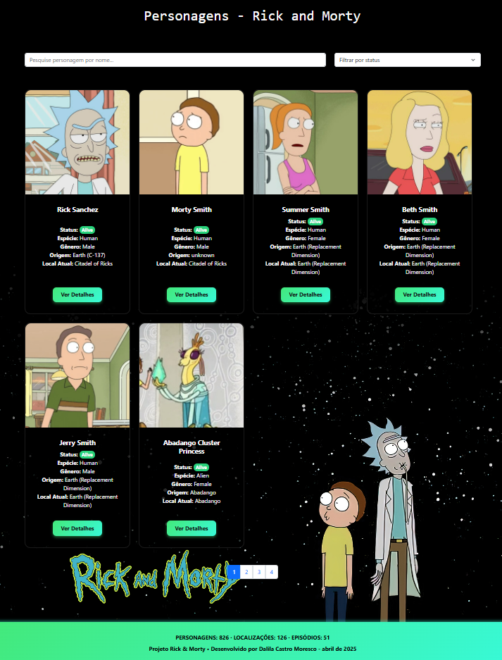
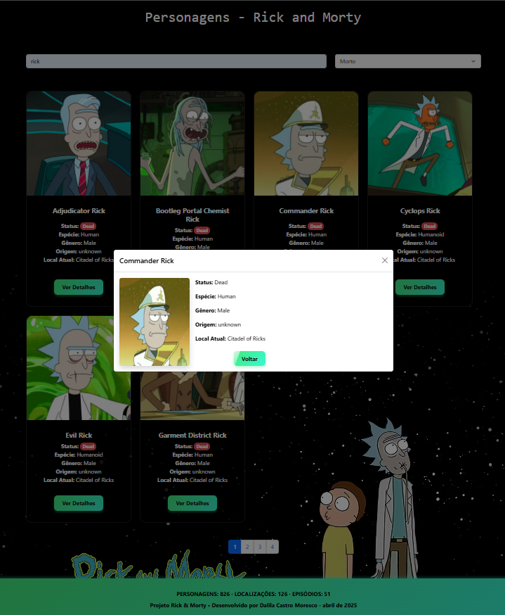

# 💫 Projeto Rick and Morty - Bootcamp Growdev

Este é um projeto desenvolvido como desafio do Bootcamp da [Growdev](https://www.growdev.com.br/) com **HTML, CSS, JavaScript e Bootstrap**. A aplicação consome a API oficial do [Rick and Morty](https://rickandmortyapi.com/) e exibe os personagens em uma interface estilizada, com filtros, animações e detalhes individuais.

---

## 🧪 Tecnologias utilizadas

- HTML5
- CSS3
- JavaScript (ES6+)
- Bootstrap 5
- [Rick and Morty API](https://rickandmortyapi.com/)

---

## ✨ Funcionalidades

- ✅ Listagem de personagens com nome, imagem, status, espécie e localização
- ✅ Filtro por nome e status
- ✅ Paginação com 6 personagens por página (2 linhas de 3 cards)
- ✅ Página de detalhes completa de cada personagem
- ✅ Contadores de personagens, episódios e localizações
- ✅ Layout responsivo e com animações CSS

---

## 📸 Capturas de tela

  

  

---

## 🔗 Acesse o Projeto Online

Confira a versão publicada no GitHub Pages:  
👉 [Rick and Morty Project - GitHub Pages](https://dalilaccastro.github.io/Rick-Morty/)

---

## 🚀 Como rodar o projeto

- Clone este repositório:
git clone https://github.com/dalilaccastro/Rick-Morty.git

- Acesse a pasta do projeto
cd Rick-Morty

- Abra o arquivo index.html em seu navegador

---
