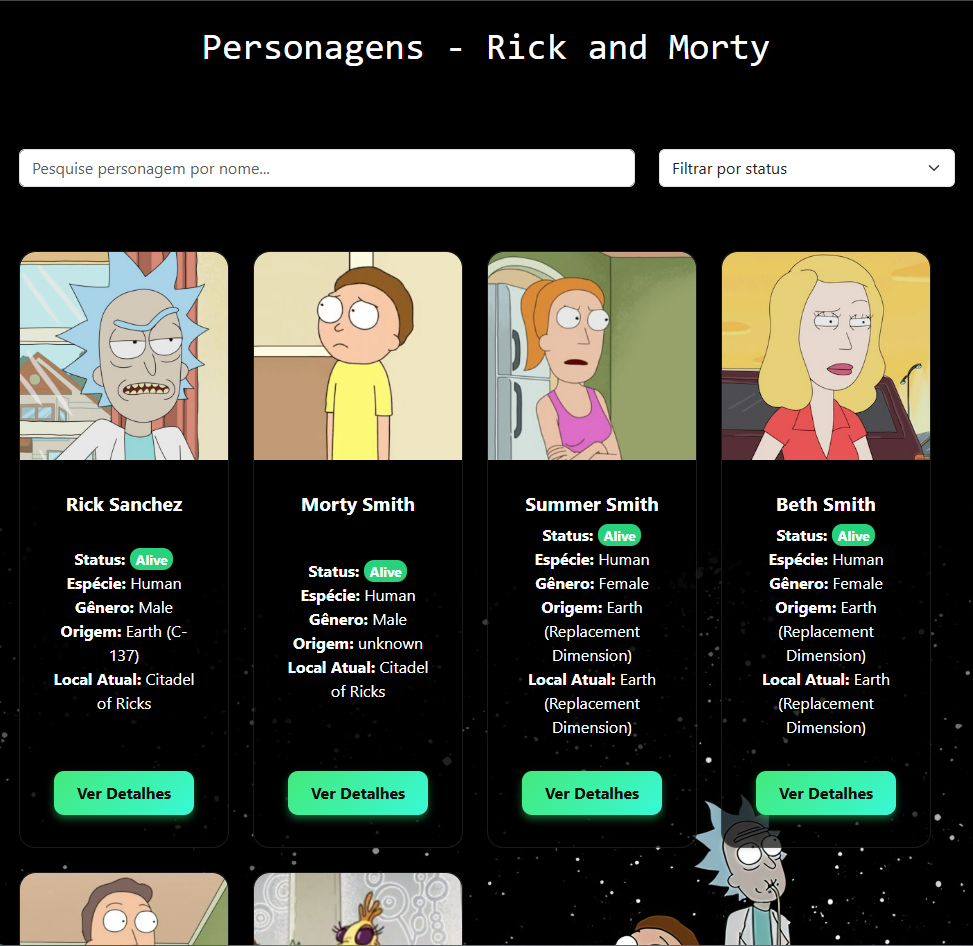
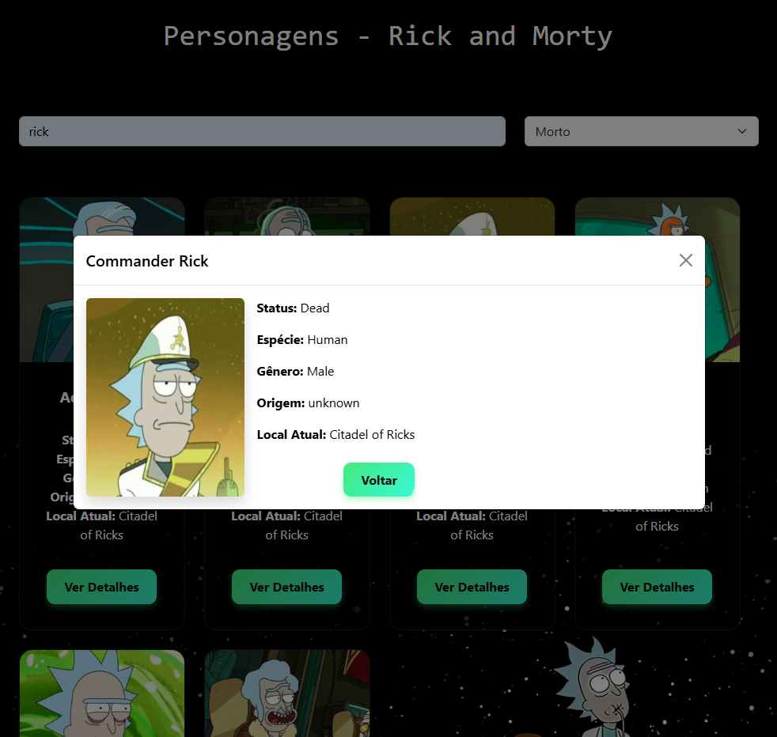

# 💫 Projeto Rick and Morty - Bootcamp Growdev

  
  
  
  
  
  

Este é um projeto desenvolvido como desafio do Bootcamp da [Growdev](https://www.growdev.com.br/) com **HTML, CSS, JavaScript e Bootstrap**. A aplicação consome a API oficial do [Rick and Morty](https://rickandmortyapi.com/) e exibe os personagens em uma interface estilizada, com filtros, animações e detalhes individuais.

---

## 🧪 Tecnologias utilizadas

- HTML5  
- CSS3  
- JavaScript (ES6+)  
- Bootstrap 5  
- [Rick and Morty API](https://rickandmortyapi.com/)

---

## ✨ Funcionalidades

- ✅ Listagem de personagens com nome, imagem, status, espécie e localização  
- ✅ Filtro por nome e status  
- ✅ Paginação com 6 personagens por página (2 linhas de 3 cards)  
- ✅ Página de detalhes completa de cada personagem  
- ✅ Contadores de personagens, episódios e localizações  
- ✅ Layout responsivo e com animações CSS  

---

## 📸 Capturas de tela

  
  

---

## 🔗 Acesse o Projeto Online

Confira a versão publicada no GitHub Pages:  
👉 [Rick and Morty Project - GitHub Pages](https://dalilaccastro.github.io/Rick-Morty/)

---

## 🚀 Como rodar o projeto

- Clone este repositório:  
`git clone https://github.com/dalilaccastro/Rick-Morty.git`

- Acesse a pasta do projeto:  
`cd Rick-Morty`

- Abra o arquivo `index.html` em seu navegador

---

# 💫 Rick and Morty Project - Growdev Bootcamp

  
  
  
  
  
  

This project was developed as a challenge for the [Growdev](https://www.growdev.com.br/) Bootcamp using **HTML, CSS, JavaScript, and Bootstrap**. The application consumes the official [Rick and Morty API](https://rickandmortyapi.com/) and displays characters in a styled interface, featuring filters, animations, and detailed views.

---

## 🧪 Technologies Used

- HTML5  
- CSS3  
- JavaScript (ES6+)  
- Bootstrap 5  
- [Rick and Morty API](https://rickandmortyapi.com/)

---

## ✨ Features

- ✅ Character listing with name, image, status, species, and location  
- ✅ Filter by name and status  
- ✅ Pagination with 6 characters per page (2 rows of 3 cards)  
- ✅ Complete detail page for each character  
- ✅ Counters for characters, episodes, and locations  
- ✅ Responsive layout with CSS animations

---

## 📸 Screenshots

  
  

---

## 🔗 Live Project

Check out the live version on GitHub Pages:  
👉 [Rick and Morty Project - GitHub Pages](https://dalilaccastro.github.io/Rick-Morty/)

---

## 🚀 How to Run the Project

- Clone this repository:  
`git clone https://github.com/dalilaccastro/Rick-Morty.git`

- Navigate to the project folder:  
`cd Rick-Morty`

- Open the `index.html` file in your browser

---
